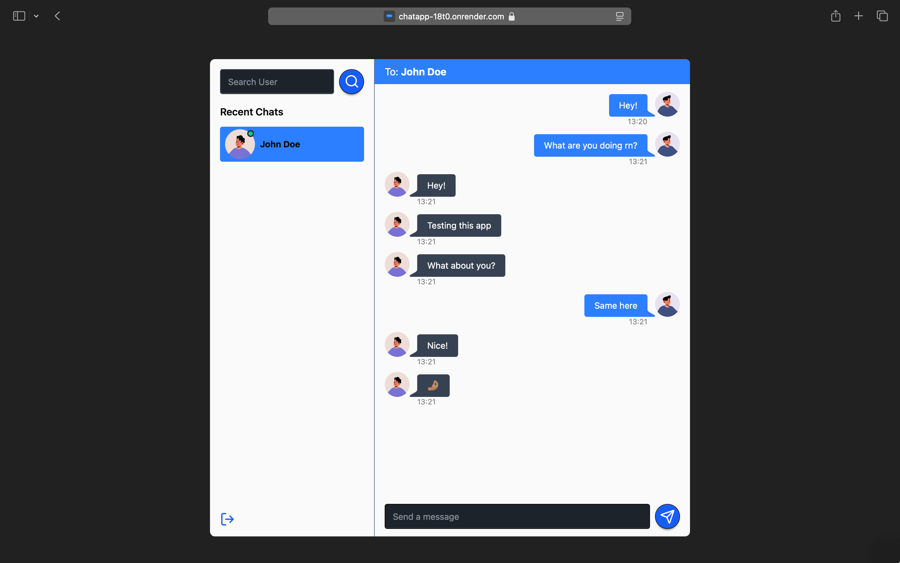

# ChatApp (with PERN Stack)

A Full-Stack real-time chat application built with the **PERN stack** (PostgreSQL, Express, React, Node.js) and WebSockets using **Socket.io**. Features real-time messaging, user authentication, and a modern UI.

[Give it a try! 📱](https://chatapp-18t0.onrender.com/)



> ⚠️ **Disclaimer:** This project was built by following a tutorial created by **Codesistency**. I do not claim full authorship of the original idea, but have followed, modified, and extended it for learning purposes.

- 🎥 Original YouTube Tutorial: [Watch Here](https://www.youtube.com/watch?v=vL24eiwAG_g&t=78s)
- 🧑‍💻 Original GitHub Repo: [View Code](https://github.com/burakorkmez/pern-chat-app)

---

## 🛠️ Tech Stack

### 🧑🏽‍💻 Frontend:

- React.js
- React Router DOM
- Zustand
- TailwindCSS
- DaisyUI
- React Hot Toast
- Lucide React 
- Vite

### 🧑🏽‍💻 Backend: 

- TypeScript
- Node.js
- Express.js
- PostgreSQL
- Prisma ORM
- Socket.io
- JWT
- Bcrypt

---

## 🚀 Features

- 🔐 Secure authentication using JWT
- 💬 Real-time messaging with WebSocket
- 👥 Online users indicator
- 📜 Chat history stored in PostgreSQL
- ⚡ Modern and responsive UI
- 🌙 Light & Dark mode (via DaisyUI)

## 📂 Installation & Setup

### 1. Clone the Repository

```shell
git clone https://github.com/4ubio/ChatApp.git
cd ChatApp/
```

### 2. Setup .env file in root dir

```js
DATABASE_URL=...
JWT_SECRET=...
NODE_ENV=...
PORT=...
```

### 3. Initialize Prisma

```shell
npx prisma generate
npx prisma migrate dev
```

### 4. Backend Setup & Run

```shell
npm install
npm run rev
```

### 5. Frontend Setup & Run

```shell
cd ChatApp/frontend
yarn 
yarn dev
```